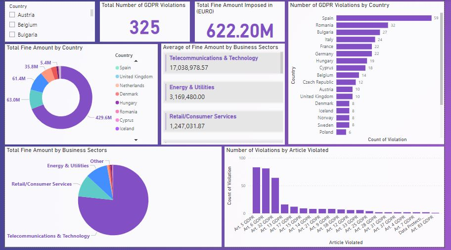

# GDPR Violations Analysis Dashboard

## Project Description

This project provides an in-depth analysis of GDPR violations across various countries, focusing on key metrics such as the total fine amount and the number of violations. The project leverages Power BI for data visualization and Excel for initial data cleaning and preparation.

## Data Source

The dataset used in this project is sourced from Kaggle, titled [GDPR Violations](https://www.kaggle.com/datasets/jessemostipak/gdpr-violations?select=gdpr_violations.csv). This dataset includes a list of GDPR violations for 2019...

## Data Preparation

- **Excel**: The initial dataset was cleaned by removing duplicate entries and blank values, ensuring the accuracy and integrity of the data.
- **Power BI Power Query**: The data was further transformed using Power Query:
  - Unnecessary columns were deleted.
  - The date column was converted to a 'Year' format.
  - The fine amount column was standardized to a currency data type.
  - The 'Article Violated' column, which contained multiple articles per entry, was split and unpivoted to ensure each violation was represented individually.
  - A new column, 'Controller Sector,' was added to classify each controller according to their sector of work using the conditional column feature.

## Visualizations

1. **Total Fine Amount by Country**: A bar chart displaying the total fines imposed by each country.
2. **Number of Violations by Article Violated**: A visual representation of the frequency of violations per GDPR article.
3. **Number of Violations by Country**: A bar chart highlighting which countries have the highest number of GDPR violations.
4. **Total Fine Amount by Business Sector**: A breakdown of total fines according to the sector of the controller, offering insights into industry-specific compliance issues.
5. **Average of Fine Amount by Business Sector**: A card illustrating the average fine amount per business sector.
6. **Cards**: Two cards were added to the dashboard to display the "Total Fine Amount" and the "Total Number of Violations" at a glance.
7. **Country Filter**: A filter was included to allow users to drill down into the data by country, providing more granular insights.

## Insights

This project highlights the widespread impact of GDPR across various sectors and countries, offering key insights into areas with the highest risk of non-compliance. The combination of thorough data preparation and targeted visualizations provides a comprehensive view of GDPR enforcement and its financial implications.

## How to Use

1. Clone the repository to your local machine.
2. Open the Power BI file to explore the dashboard and gain insights from the visualizations.
3. Use the country filter to drill down into specific regions and analyze the data in more detail.
