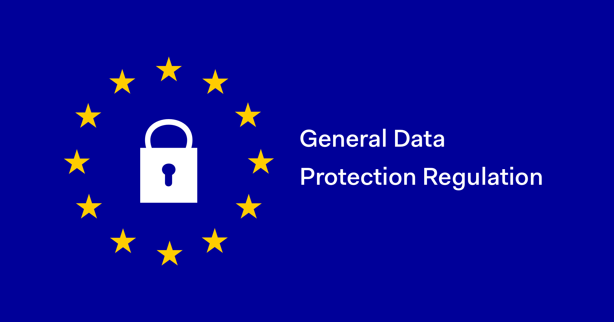
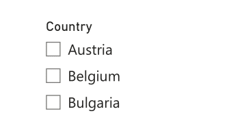

# GDPR Violations Analysis Dashboard

  

## Project Description

This project provides an in-depth analysis of GDPR violations across various countries, focusing on key metrics such as the total fine amount and the number of violations. The project leverages Power BI for data visualization and Excel for initial data cleaning and preparation.

## Data Source

The dataset used in this project is sourced from Kaggle, titled [GDPR Violations](https://www.kaggle.com/datasets/jessemostipak/gdpr-violations?select=gdpr_violations.csv). This dataset includes a list of GDPR violations for 2019...

## Data Preparation

- **Excel**: The initial dataset was cleaned by removing duplicate entries and blank values, ensuring the accuracy and integrity of the data.
- **Power BI Power Query**: The data was further transformed using Power Query:
  - Unnecessary columns were deleted.
  - The date column was converted to a 'Year' format.
  - The fine amount column was standardized to a currency data type.
  - The 'Article Violated' column, which contained multiple articles per entry, was split and unpivoted to ensure each violation was represented individually.
  - A new column, 'Controller Sector,' was added to classify each controller according to their sector of work using the conditional column feature.
 
- After our data preparation, our dataset includes the following columns: 'violation', 'country', 'authority', 'controller', 'fine amount in euros', 'type of violation', 'year', 'article violated', and 'controller sector' .

## Visualizations

1. **Total Fine Amount by Country**:

A bar chart displaying the total fines imposed by each country, with France leading at €429.56M, followed by Italy (€63.05M) and Austria (€61.38M). This allows users to quickly compare the financial penalties imposed in different regions.

  

2. **Number of Violations by Article Violated**:

This clustered column chart showing the number of GDPR violations corresponding to specific articles, with Article 5 (data processing principles) being violated 83 times and Article 6 (lawfulness of processing) 81 times. Lesser violations occurred in other articles, such as Article 9 (data processing of sensitive data).

  

3. **Number of GDPR Violations by Country**:

A stacked bar chart shows the total number of GDPR violations reported across various countries. Spain leads with 59 violations, followed by Romania with 32 and Bulgaria with 27. The countries are ordered to highlight the top violators.
   

  

4. **Total Fine Amount by Business Sector**:

This Pie chart breaks down the total fines incurred by business sectors, showing that telecommunications and technology faced the largest overall penalties (€477.09M). Other significant sectors include retail and consumer services and energy.

  

5. **Average of Fine Amount by Business Sector**:

This muti-row card illustrating the average fine amount in Euro per business sector. This card displays the average GDPR fine amount per sector, with telecommunications and technology having the highest average fine (€17,038,978.57). Other sectors such as energy and utilities, and retail/consumer services also see significant penalties, while sectors like real estate and legal consultancy experience smaller fines.

  

6. **Cards**: Two cards were added to the dashboard to display the "Total Fine Amount" and the "Total Number of Violations" at a glance.

7. **Country Filter**: A filter was included to allow users to drill down into the data by country, providing more granular insights.

  

## Dashboard

How the dashboard looks:

## Key Insights

- **High Violation Rates in Spain**: Spain tops the list with the highest number of violations (59), indicating a potential focus for regulatory bodies and businesses operating in the region to strengthen their compliance mechanisms.

- **Telecom and Technology Sector Faces the Heaviest Fines**: With an average fine of over €17M, the telecommunications and technology sector faces the highest financial penalties, pointing to significant compliance risks in this industry.

- **France Dominates Total Fine Amounts**: France has accumulated the highest total fine amount at €429.56M, signaling that GDPR enforcement in the country has been particularly stringent and impactful.

- **Articles 5 and 6 Are the Most Violated**: Articles dealing with data processing principles and lawful processing see the most violations, suggesting that businesses struggle with basic compliance on fundamental data privacy principles.

- **Energy and Retail Sectors Face Notable Risks**: These sectors show a high average fine and significant total fines, indicating potential compliance vulnerabilities that need to be addressed.
